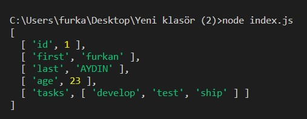
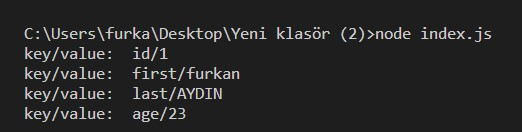

```javascript
 <script>
    ...
    $.ajax({
        type: "POST",
        url: "/Product/InsertProduct",
        data: form,
        processData: false,
        contentType: false,
        success: (data) => {
            console.log(data);
        },
        error: (e) => {
            console.log("Erorr occured: " + e);
        }
    });
    ...
</script>
```

- **ProcessData'yı** false olarak ayarlamak, jQuery'nin verileri otomatik olarak bir sorgu dizesine dönüştürmesini önlemenizi sağlar.
- **ContentType'ın** false olarak ayarlanması zorunludur, aksi takdirde jQuery onu yanlış ayarlayacaktır.

## FormData Object
```javascript
<script>
    $(document).ready(() => {
        ...
        formElement.addEventListener("submit",(e)=>{
            e.preventDefault();

            const form = new FormData(formElement);
        ...
        });
    });
</script>
```

Yukarıdaki kodda form elementinin submit event i tetiklendiğinde **e.preventDefault()** statement ı ile varsayılan form gönderimi engellenir. Daha sonra **formdata event** ini tetiklemek için bir **FormData** object oluşturulur. Bu object ile requst oluşturulur ve web server a gönderilir. Örnek kodda JQuery.ajax() fonksiyonunun sağladığı AJAX yöntemi ile request oluşturulur. Eğer Fetch API ile bir request oluşturulsaydı yine e.preventDefault() fonksiyonu ile varsayılan form gönderimi engellenilecekti.

- **event.preventDefault()** fonksiyonu, ilgili event iptal edilebilir ise bu event iptal edilir. Yani event tetiklendiğinde bir action gerçekleşecek ise bu iptal edilecektir. Örneğin şu senaryolarda kullanışlı olabilir:
    - Type ı **submit** olan butona tıklandığında, formun gönderilmesi engellenir.
    - Bir linke click olunduğunda, URL e yönlendirme engellenir.

**Note:** Her event iptal edilemez. Bir event in iptal edilebilir olduğunu öğrenmek için **cancelable** property kullanılabilir. 

```javascript
    // return true or default
    event.cancelable;
```

### FormData Methods
Aşağıdaki fonksiyonlar ile FormData object deki field lar üzerinde değişiklik yapılabilir.
- **FormData.append(name,value),** name ve value parametrelerinin değerleri ile bir form field ekler.
- **FormData.append(name,blob,fileName),** <input type="file"> gibi bir form field ekler. Üçüncü parametre olan fileName, eğer form field bir isme sahip değil ise dosyaya bir isim ayarlar.
- **FormData.delete(name),** name parametresinin değerine göre ilişkili form field silinir.
- **FormData.get(name),** name parametresinin değerine göre ilişkili form field ın değeri döndürülür.
- **FormData.getAll(name),** name parametresinin değerine göre ilişkili tüm form field ların değerleri bir array ile döndürülür.
- **FormData.has(name),** eğer name parametresinin değerine göre bir form field var ise **true** yok ise **false** döner.
- **FormData.keys(),** FormData object deki tüm key/value çiftlerinin key değerlerini yani form field ların değerlerini döner. 
- **FormData.values(),** FormData object deki tüm key/value çiftlerinin value değerlerini yani form field ların değerleri döner.  
- **FormData.entries(),** FormData object deki tüm key/value çiftlerini bir dizi ile döner.
- **FormData.set(name,value),** eğer name değeri ile ilişkili bir field var ise value parametresinin değeri ile değiştirir, eğer yok ise field ı ekler ve değerini atar.

## Convert an Object to FormData
**Object.entries()**, alınan bir object in key/value çiftlerinin dizisini döner.

```javascript
const employee = {
    id: 1,
    first: 'furkan',
    last: 'AYDIN',
    age: 23 ,
    tasks: ['develop', 'test', 'ship'],
};

console.log(Object.entries(employee));
```
**Output:**



Object.entries() fonksiyonundan dönen datalar üzerinde daha kolay iterasyon yapabilmek için [destructuring assignment expression](https://developer.mozilla.org/en-US/docs/Web/JavaScript/Reference/Operators/Destructuring_assignment) kullanılabilir.

```javascript
const employee = {
    id: 1,
    first: 'furkan',
    last: 'AYDIN',
    age: 23,
};

Object.entries(employee).forEach(([key, value]) => {
    console.log("key/value:  " + key + "/" + value);
});
```
**Output:**



## Fetch API
Modern browserlar JQuery.ajax() fonksiyonu ile XMLHttpRequest object üzerinde çalışarak AJAX request oluşturmak yerine Fetch API kullanabilirler. Fetch API, AJAX gibi web serverlara HTTP request oluşturmak için browserlara izin verir. Ancak Fetch API XMLHttpRequest objesine göre daha güçlü ve esnek bir yapıya sahiptir.

- https://javascript.info/formdata](https://javascript.info/formdata)
- [https://learn.microsoft.com/en-us/aspnet/core/mvc/models/file-uploads?view=aspnetcore-7.0](https://learn.microsoft.com/en-us/aspnet/core/mvc/models/file-uploads?view=aspnetcore-7.0)

## Kaynaklar
- [https://developer.mozilla.org/en-US/docs/Web/API/FormData/Using_FormData_Objects#using_a_formdata_event](https://developer.mozilla.org/en-US/docs/Web/API/FormData/Using_FormData_Objects#using_a_formdata_event)
- [https://developer.mozilla.org/en-US/docs/Web/API/FormData](https://developer.mozilla.org/en-US/docs/Web/API/FormData)

